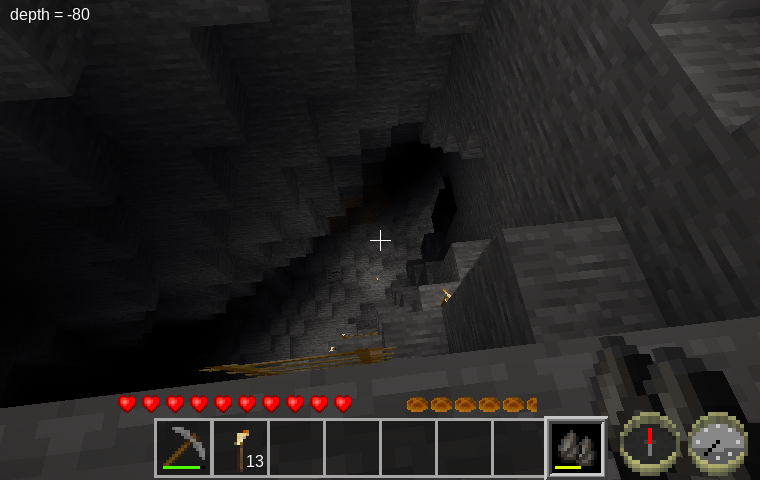

Depth Finder [depth\_finder]
============================
Help find the deep passages in caves.

By David G (kestral246@gmail.com)

With my Quarry Mechanics mod, it's necessary to find iron to do any stone construction, but digging stone is also more difficult. I would try to find deep caves to avoid digging, but I was wasting a lot of time exploring shallow caves. Also, it's easy to miss some of the deep passages without spending a lot of time systematically exploring.

To make it easier to reach iron (which will work equally well without the quarry mod), I've created this depth\_finder mod. It scans air nodes in front of the player and reports the deepest point found. Checking different directions will help determine if a cave goes very deep, and which direction to find these deep spots.

For efficiency it just searches a cylindrical sector in the direction pointed, so it could miss finding particularly winding passages. *(Based on my wand\_of\_illumination mod.)*

Now as to my choice of tool provided—since I needed something that could be crafted before a lot of digging, my choices were limited. My thought with two flints was that they could be banged together, and the return echo would indicate depth.

This is obviously a silly idea, so if someone can come up with a better idea, please let me know.

Dependencies
------------

- Craft recipe optionally depends on default.

Craft Recipe
------------

Simple Depth Finder

Licenses
--------

Source code

> The MIT License (MIT)

Media (textures)

> Attribution-ShareAlike 3.0 Unported (CC BY-SA 3.0)

Current texture copied from default\_flint.png by Gambit
